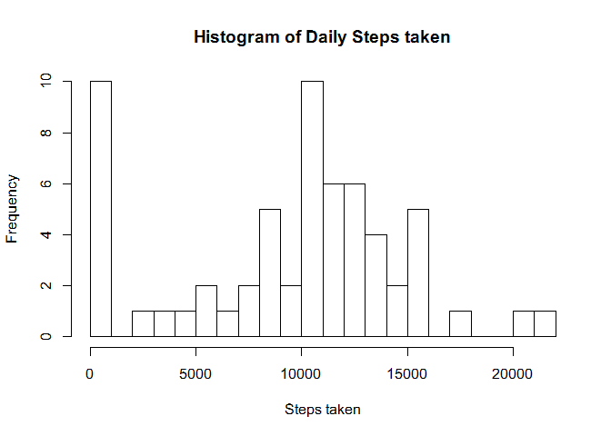
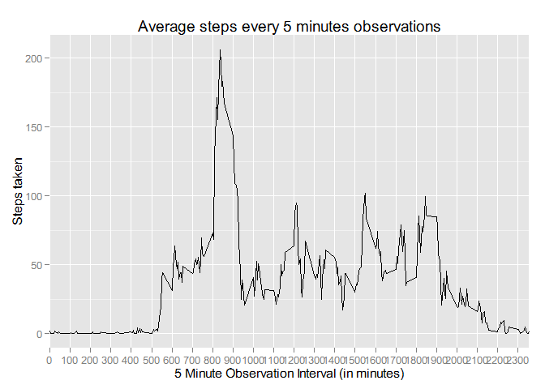
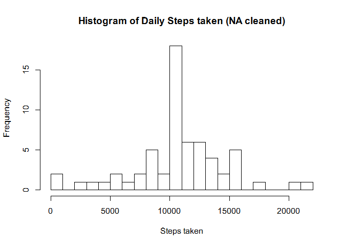
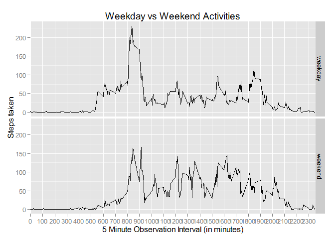

# Reproducible Research: Peer Assessment 1
Author: T. Aristanto
Date: 2/14/2015

## Loading and preprocessing the data
Load the activity.csv file from the workspace directory

```r
actdata <- read.csv("activity.csv")
```

## What is mean total number of steps taken per day?
Calculate the daily sum of steps. 

```r
library(dplyr)
```

```
## 
## Attaching package: 'dplyr'
## 
## The following object is masked from 'package:stats':
## 
##     filter
## 
## The following objects are masked from 'package:base':
## 
##     intersect, setdiff, setequal, union
```

```r
## Calculate Daily Sum
sum_daily <- actdata %>% group_by(date) %>% summarise(sumsteps = sum(steps, na.rm=TRUE))
sum_daily
```

```
## Source: local data frame [61 x 2]
## 
##          date sumsteps
## 1  2012-10-01        0
## 2  2012-10-02      126
## 3  2012-10-03    11352
## 4  2012-10-04    12116
## 5  2012-10-05    13294
## 6  2012-10-06    15420
## 7  2012-10-07    11015
## 8  2012-10-08        0
## 9  2012-10-09    12811
## 10 2012-10-10     9900
## ..        ...      ...
```

Create the Histogram.

```r
## Create the Histogram
hist(as.numeric(sum_daily$sumsteps), breaks = 30, main = "Histogram of Daily Steps taken", xlab = "Steps taken", ylab ="Frequency")
```

 

Get the mean and median number.

```r
summary(sum_daily)
```

```
##          date       sumsteps    
##  2012-10-01: 1   Min.   :    0  
##  2012-10-02: 1   1st Qu.: 6778  
##  2012-10-03: 1   Median :10395  
##  2012-10-04: 1   Mean   : 9354  
##  2012-10-05: 1   3rd Qu.:12811  
##  2012-10-06: 1   Max.   :21194  
##  (Other)   :55
```

## What is the average daily activity pattern?
Get the Interval Average

```r
sum_daily2<- actdata %>% group_by(interval) %>% summarise(meansteps = mean(steps, na.rm=TRUE))
sum_daily2
```

```
## Source: local data frame [288 x 2]
## 
##    interval meansteps
## 1         0 1.7169811
## 2         5 0.3396226
## 3        10 0.1320755
## 4        15 0.1509434
## 5        20 0.0754717
## 6        25 2.0943396
## 7        30 0.5283019
## 8        35 0.8679245
## 9        40 0.0000000
## 10       45 1.4716981
## ..      ...       ...
```

Plot the data as time interval 

```r
library(ggplot2)
ggplot(sum_daily2, aes(as.numeric(interval), meansteps)) + geom_line() + scale_x_discrete(breaks=seq(0, 2400, by=100)) + ggtitle("Average steps every 5 minutes observations") + xlab("5 Minute Observation Interval (in minutes)") + ylab("Steps taken")
```

 

No.2 From The function below it can be seen that the max steps occurs at interval 835:

```r
filter(sum_daily2, meansteps == max(meansteps))
```

```
## Source: local data frame [1 x 2]
## 
##   interval meansteps
## 1      835  206.1698
```

## Imputing missing values
Replace the NA values with the 5 minutes interval average calculated above and then re-calculate the daily sum

```r
library(dplyr)
actdata2 <- merge(actdata,sum_daily2, by.X="interval")
actdata3 <- actdata2 %>% mutate(goodsteps = ifelse(is.na(steps),meansteps,steps)) %>% select(goodsteps, date, interval) %>% arrange(date,interval) 
sum_daily3 <- actdata3 %>% group_by(date) %>% summarise(sumsteps = sum(goodsteps, na.rm=TRUE))
sum_daily3
```

```
## Source: local data frame [61 x 2]
## 
##          date sumsteps
## 1  2012-10-01 10766.19
## 2  2012-10-02   126.00
## 3  2012-10-03 11352.00
## 4  2012-10-04 12116.00
## 5  2012-10-05 13294.00
## 6  2012-10-06 15420.00
## 7  2012-10-07 11015.00
## 8  2012-10-08 10766.19
## 9  2012-10-09 12811.00
## 10 2012-10-10  9900.00
## ..        ...      ...
```

Recreate the Histogram from the new data

```r
hist(as.numeric(sum_daily3$sumsteps), breaks = 30, main = "Histogram of Daily Steps taken (NA cleaned)", xlab = "Steps taken", ylab ="Frequency")
```

 

Calculate the mean and median of the data

```r
summary(sum_daily3)
```

```
##          date       sumsteps    
##  2012-10-01: 1   Min.   :   41  
##  2012-10-02: 1   1st Qu.: 9819  
##  2012-10-03: 1   Median :10766  
##  2012-10-04: 1   Mean   :10766  
##  2012-10-05: 1   3rd Qu.:12811  
##  2012-10-06: 1   Max.   :21194  
##  (Other)   :55
```

The Graph shows that less frquency of 0 steps
and also the mean and the median are closer (equal) to each other. 


## Are there differences in activity patterns between weekdays and weekends?
Add column to identify weekday and weekend the calculate the interval average

```r
actdata4 <- actdata3 %>% mutate(weektype = ifelse(weekdays(as.Date(date)) %in% c("Saturday","Sunday"),"weekend","weekday"))
meanweek <- actdata4  %>% group_by(weektype,interval) %>% summarise(meansteps = mean(goodsteps, na.rm=TRUE))
meanweek
```

```
## Source: local data frame [576 x 3]
## Groups: weektype
## 
##    weektype interval  meansteps
## 1   weekday        0 2.25115304
## 2   weekday        5 0.44528302
## 3   weekday       10 0.17316562
## 4   weekday       15 0.19790356
## 5   weekday       20 0.09895178
## 6   weekday       25 1.59035639
## 7   weekday       30 0.69266247
## 8   weekday       35 1.13794549
## 9   weekday       40 0.00000000
## 10  weekday       45 1.79622642
## ..      ...      ...        ...
```

Plot the graph for weekday and weekend

```r
library(ggplot2)
ggplot(meanweek, aes(x=interval, y=meansteps)) + geom_line() + scale_x_discrete(breaks=seq(0, 2400, by=100)) + facet_grid(weektype ~ .) + ggtitle("Weekday vs Weekend Activities") + xlab("5 Minute Observation Interval (in minutes)") + ylab("Steps taken")
```

 
